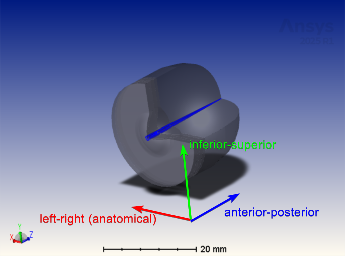

# Notes on asymmetric models

By default, Visisipy's eye models are rotationally symmetric, meaning all surfaces can be described by a single radius of curvature and asphericity.
It is also possible to model asymmetric eyes using {py:class}`biconic surfaces <visisipy.models.geometry.BiconicSurface>`. 
This is useful if you want to model astigmatism or astigmatic intraocular lenses.

Biconic surfaces have two radii of curvature and asphericities.
Following the conventions for optical systems, these directions are defined in an $(x, y, z)$ coordinate system, where the $z$-axis is the optical axis,
the $x$-axis is the horizontal axis, and the $y$-axis is the vertical axis.
These table and figure below show how these axes correspond to the anatomical axes of the eye:

| Axis | Anatomical axis | 
| ---- | --------------- | 
| $x$ | Left - Right |
| $y$ | Inferior - Superior |
| $z$ | Anterior - Posterior |

:::{warning}
The Left - Right axis refers to the _anatomical_ definition, i.e. looking from the back of the eye towards the front.
Consequently, this axis corresponds to the Temporal - Nasal direction in the left eye and the Nasal - Temporal direction in the right eye.
:::

